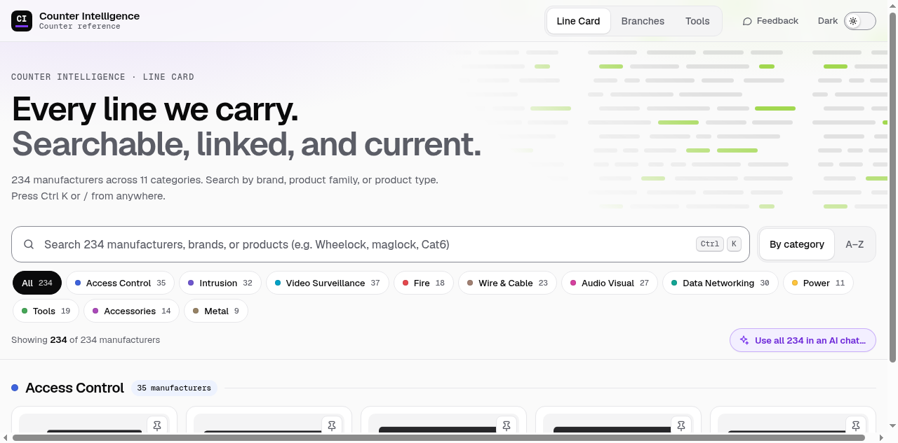
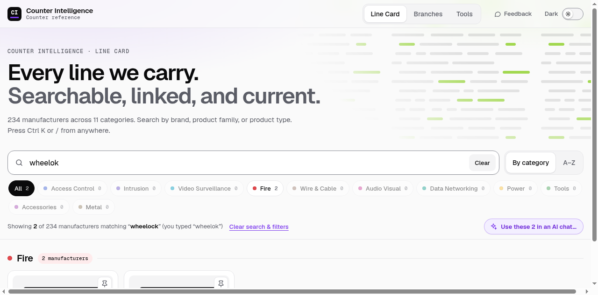
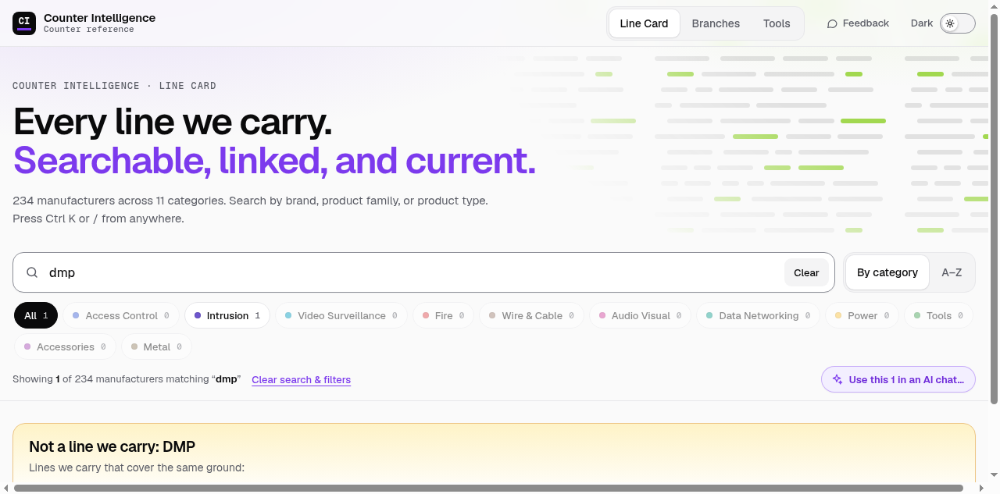
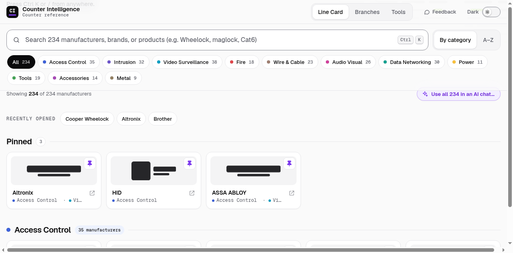
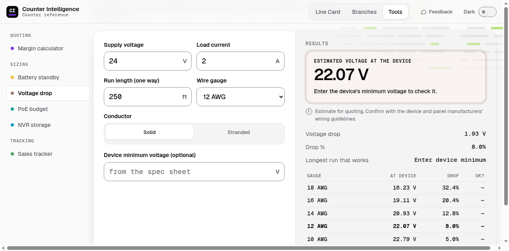
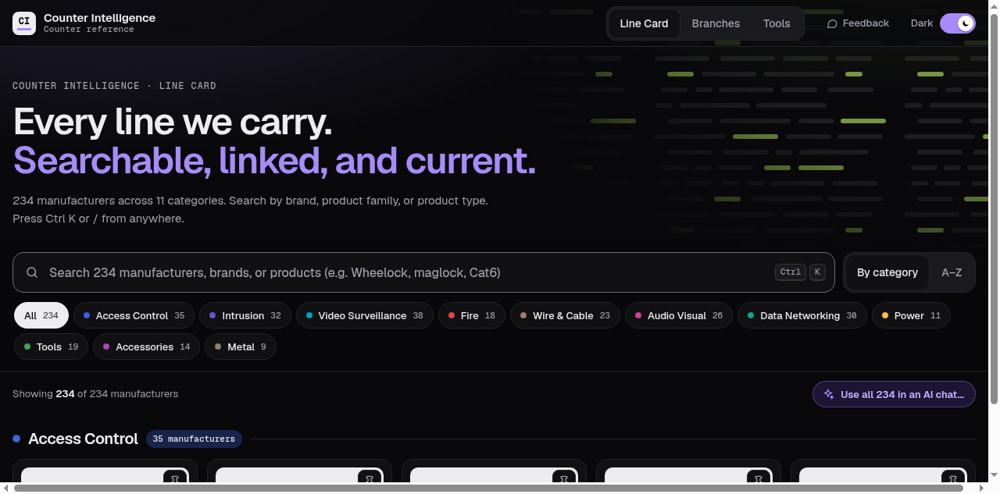
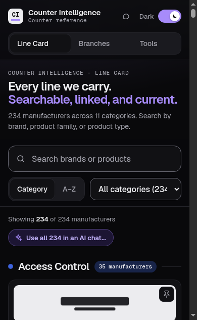
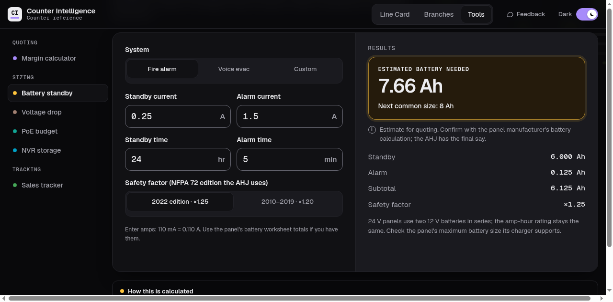

# Counter Intelligence

A fast, keyboard-first reference app for the sales counter of a security and low-voltage distributor.
It answers the questions reps get asked all day — _do we carry that brand?_, _what can I offer instead?_,
_which branch has it?_, _how big a battery does this panel need?_ — in a single search box or a single
calculator, on a desktop or a phone.

[](https://github.com/rchps/counter-intelligence-angular/actions/workflows/ci.yml)



> Manufacturer logos are replaced with redaction bars in these screenshots.

**Angular 22** (standalone components, signals, zoneless) · **TypeScript** · **SCSS** ·
**Vitest** · **Cypress** (end-to-end and pixel-level visual regression) · **GitHub Actions** ·
**Cloudflare Workers**

## Contents

- [Highlights](#highlights)
- [Features](#features)
- [Quick start](#quick-start)
- [Documentation](#documentation)
- [Credits](#credits)
- [License](#license)

## Highlights

- **Search that forgives how people actually type.** Typo correction ("wheelok" finds Wheelock), product
  terms ("horn strobe" finds its manufacturers), brand aliases, and a "did you mean" — all in pure,
  unit-tested TypeScript with no search library.
- **Answers "no" usefully.** Searching a brand the company doesn't carry explains that, and offers the
  lines it does carry that cover the same ground.
- **Six quoting and sizing tools** whose math cites its sources: NFPA 72 for battery standby, NEC
  Chapter 9 for voltage drop, IEEE 802.3af/at/bt for PoE budgets.
- **Almost no backend.** Static JSON data, a static site, and build-time configuration. The one bit of
  server code files feedback as GitHub issues, anonymously, behind a Turnstile bot check.
- **Tested at three levels,** and every pull request is compared pixel by pixel against `main` in light and dark
  mode, on desktop and phone.
- **Accessible by default:** WCAG AA as the target, native dialogs, ARIA patterns where HTML falls
  short, full keyboard use, and motion that respects reduced-motion settings.

## Features

### Line Card: every manufacturer carried

230+ manufacturers across 11 categories, each linking to its website. Browse by category or A–Z (with a
jump bar), filter with category chips that show live counts, or search.



- **Typo tolerance.** Each word is corrected to the closest word the data knows, allowing more edits for
  longer words. The status line says what was searched instead, so the correction is never silent.
- **Product-type search.** About 110 product terms, each with the ways people type them, are merged into
  each manufacturer's searchable text.
- **Ranking that follows research.** Exact names first, then names that start with the search, then
  names that contain it, then other matches — in one list, not a separate "best match" box (per NN/g).
- **Shareable state.** The search, filter and view live in the address bar, so a result can be
  bookmarked or sent to a coworker.
- **Ctrl K or `/`** focuses search from anywhere on the page.



- **"Not a line we carry."** About 30 brands that reps get asked for but the company doesn't carry map
  to the lines that cover the same ground, with an optional factual note.
- **Pinned and recently opened manufacturers.** Pin the lines you look up all day to the top of the page;
  the last few sites you opened stay one click away. Both are saved in the browser.
- **"Use in an AI chat."** Copies the Line Card (or the current results) as plain text with short
  instructions, so an AI assistant only suggests lines that are actually carried. Only public
  information goes in: no pricing, branches, or customer data.



### Tools: quoting and sizing math



| Group    | Tool              | What it answers                                                          |
| -------- | ----------------- | ------------------------------------------------------------------------ |
| Quoting  | Margin calculator | Any two of cost, price and margin give the third                         |
| Sizing   | Battery standby   | Amp-hours for fire and security panels (NFPA 72 standby and alarm times) |
| Sizing   | Voltage drop      | Will the wire run make it? Compares every gauge at once                  |
| Sizing   | PoE budget        | Can the switch power every device, by IEEE 802.3 class                   |
| Sizing   | NVR storage       | How much drive a camera system needs for its retention                   |
| Tracking | Sales tracker     | Daily sales against a monthly goal, with a pace chart drawn in plain SVG |

Every sizing tool shows its formula and sources under "How this is calculated", and labels its result as
an estimate for quoting: final designs follow the manufacturer's calculations and the local authority.

### Branches

Every branch with its address and main number, searchable by city, state, ZIP or any part of a phone
number, with state chips, tap-to-call links, and a map link for each address. Typing a lone state code
lists that state's branches.

### Everywhere

- **Light and dark themes.** Follows the system setting until someone flips the switch, then remembers
  their choice.
- **Built for phones too.** The same pages, laid out for a narrow screen, with dialogs that become
  bottom sheets.
- **Smooth, not flashy.** Pages cross-fade, and cards glide to their new places when a filter changes.
- **A guided tour.** First-time visitors get a quiet offer of a 30-second tour through the parts
  that are easy to miss: product-type search, "Use in an AI chat", "Not a line we carry", pins and
  feedback. Anyone can replay it from the footer.
- **Feedback from any page.** A "report a problem or suggest an idea" dialog files a GitHub issue,
  without the rep's name, that already names the page, the search, and the exact build.

<p>
  
  
</p>



## Quick start

Requires **Node 24** (pinned in `.nvmrc`):

```bash
nvm install && npm ci
npm start          # http://localhost:4200
```

More in [Development](docs/development.md).

## Documentation

- [Architecture and design decisions](docs/architecture.md): how the app is put together, and why
- [Development](docs/development.md): setup, build-time settings, npm scripts
- [Testing](docs/testing.md): unit, end-to-end and visual regression tests, and the screenshot review on PRs
- [Git hooks and CI/CD](docs/ci-cd.md): what runs on commit, on push, and in GitHub Actions
- [Keeping the data current](docs/data.md): the data files, adding a manufacturer or a logo

## Credits

Built by Justin Tullos, with Claude Code (Anthropic's AI coding assistant) as a pair programmer.

## License

The code is available under the [MIT License](LICENSE). The license doesn't cover the content in
`public/data/` or the manufacturer logos in `public/logos/`, which are their manufacturers' trademarks.
